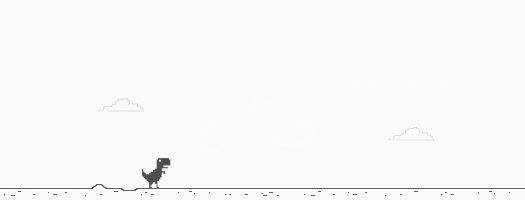

# dino-game

T-Rex Game, é um jogo integrado ao navegador de internet Google [Chrome](https://www.google.com/chrome/).
Criado por [Sebastien Gabriel]() em 2014. Este jogo se torna interessante em momentos
em que o usuário esta ocioso sem acesso a internet.
Maiores informações na [wikipedia](https://pt.wikipedia.org/wiki/T-Rex_Game)

Este projeto é parte integrante do bootcamp Impulso React Web Developer da [Dio](https://web.dio.me).

### Tecnologias usadas no projeto.
[HTML5](https://developer.mozilla.org/en-US/docs/Web/HTML) - HyperText Markup Language.

[CSS](https://developer.mozilla.org/en-US/docs/Web/CSS) - Cascading Style Sheets

[JavaScript](https://developer.mozilla.org/en-US/docs/Web/JavaScript) - Linguagem de programação dinâmica

